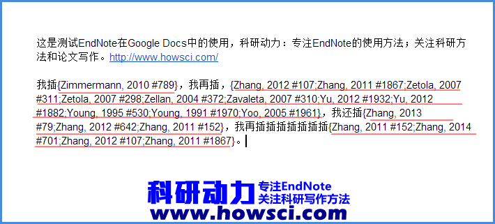
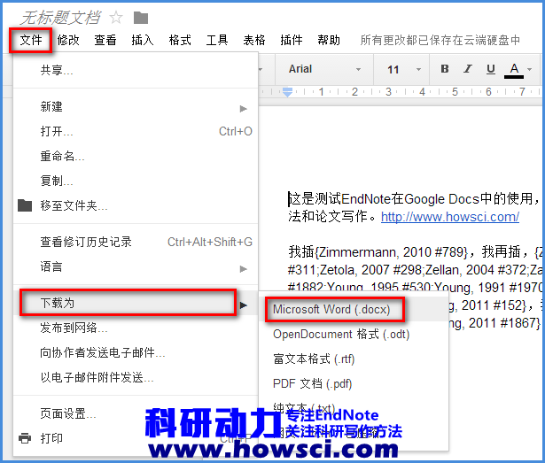
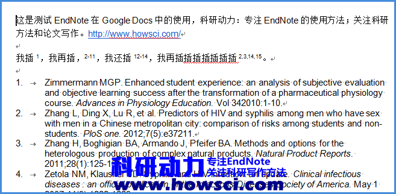

# Google Docs中插入文献

Google Docs虽然现在国内很悲催，但是还是想说说[EndNote](https://www.howsci.com/tag/endnote/)如何在Google Docs中插入参考文献的方法。其实本质上实现方法同[EndNote在WPS中的使用方法](https://www.howsci.com/endnote-used-with-wps.html)一样。

### Google Docs

[Google Docs](https://docs.google.com/)是谷歌办公套件，类似于微软的[Office](https://www.howsci.com/category/office/)的一套在线办公软件.相比于微软的的[Office](https://www.howsci.com/category/office/)，[Google Docs](https://docs.google.com/)免费是最大特色，[Google Docs](https://docs.google.com/)可以处理和搜索文档、表格、幻灯片，并可以通过网络和他人分享。更多有关Google Docs的信息可以自行Google或者问度娘，或者直接看看百度百科的[Google Docs词条](http://baike.baidu.com/view/1301789.htm)。

要想使用Google Docs，前题是要有一个Google的帐号，真是废话啊。其实在国内，更前题的是你需要能上去Google！

怎么上Google？恐怕是最近讨论最多的话题了，我就不多说了，自己找找吧。

### [EndNote](https://www.howsci.com/tag/endnote)在Google Docs中的使用方法

其实[EndNote](https://www.howsci.com/tag/endnote/)是无法直接在Google Docs插入文献的，又是一句废话！不能插还在这嘀咕神马？！

可是不能直接插入，还是可以通过变通的方法来实现[EndNote](https://www.howsci.com/tag/endnote/)在Google Docs中插入文献。下面说说步骤。

1. 打开Google Docs，新建或者打开一个文档，把光标放置在需要插入文献的地方。

2. 打开[EndNote](https://www.howsci.com/tag/endnote/)，选择需要插入的文献，然后拖到Google Docs中，注意是拖，不是脱衣解带的脱，是拖拉机的拖。把文献拖到Google Docs，拖到Google Docs！我不是老年痴呆，是一在强调。此时可以看到在Google Docs中插入的文献变成了如下图这样

从这个图上可以看出，现在插入的文献是一种中间的暂时形式。不用管它，继续撰写文章和插入文献，等待文章撰写完毕再进行下一步。

3. 如果文章已经写好了，也插好了文献，那么在Google Docs，依次选择「文件」→「下载为」→「Microsoft \(docx\)」，把文件保存在本地

4. 打开下载得到的docx文件，启用编辑，找开[EndNote](https://www.howsci.com/tag/endnote/)的工具栏，选择需要的[Output Style](https://www.howsci.com/tag/output-styles/)，然后利用「Update Citations and Bibliography」重新格式化一下文献即可。

世界终于清净了，参考文献加来了

