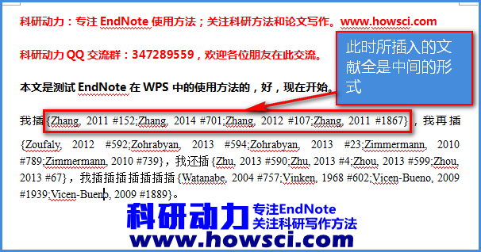
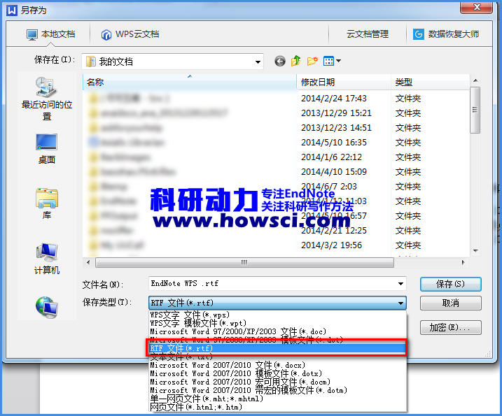
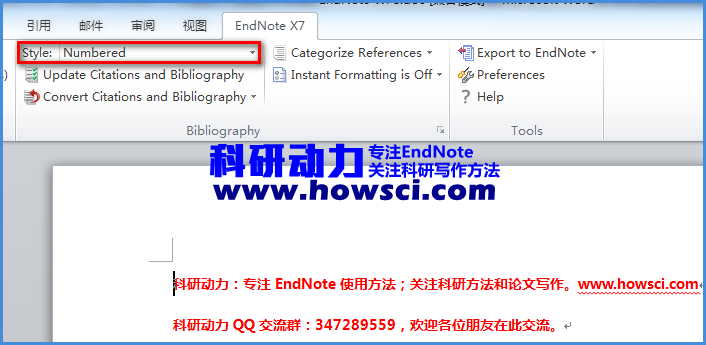
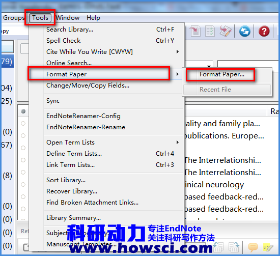
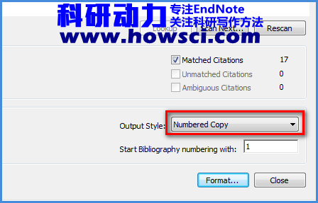

# WPS中插入文献

WPS是一款优秀的国产办公软件，WPS诠释了免费的东西也有好东西。但是[EndNote](https://www.howsci.com/tag/endnote/)在WPS中并不能直接使用，WPS官方也不知道为何不出一个EndNote的插件。但是这并不是说[EndNote](https://www.howsci.com/tag/endnote/)不能在WPS中使用，本文就介绍一下EndNote如何在WPS中使用，[EndNote](https://www.howsci.com/tag/endnote/)如何在WPS中插入和删除文献。

### EndNote在WPS中的使用方法

1. 首先打开WPS，新建或者打开一个原有的Word文档，我是新建了一个。把光标放置在需要插入文献的地方。

2. 打开[EndNote](https://www.howsci.com/tag/endnote/)，选中需要插入的文献。如果是插入多篇文献，可以使用Ctrl或者Shift键多选。

3. **此步最重要，把选中的文献用鼠标左键按住，拖到WPS需要插入文献的地方。**记住是把文献拖到WPS中！此时所插入的文献就变成了EndNote的插入文献时的未格式化形式。如下图所示。

如果想删除文献，直接删除即可。但是要注意删除完全，比如下图中的其中的一篇文献为「Zhang, 2011 \#152」，要是想删除这篇文献，需要完全删除掉Zhang, 2011 \#152，后面如果有逗号也要删除。但是**注意所插入文献的前后括号{}不要删除！**

4. 继续撰写论文，插入文献，重复第3步步骤。

5. 撰写完论文后保存文档，有两种方法，一是保存为[Word 2003](https://www.howsci.com/tag/word/)的形式，即doc文档，如「科研动力.doc」，或者保存为[Word 2007](https://www.howsci.com/tag/word/)新形式，即docx形式，如「科研动力.docx」。这两种保存方法最后的操作都一样，我个人保存类型就选择这2种最好。

另外一种形式是保存为rtf格式，如「[科研动力](https://www.howsci.com/).rtf」

### EndNote格式化文件

因为保存文件格式的不同，EndNote格式化文件的方法也不同。

**1. 保存为doc或者docx文档EndNote格式化文件的方法**

使用Word打开所保存的文件，记住此时不再是用WPS打开Word文件，是利用微软Office打开WPS刚刚保存的文件，如「[科研动力](https://www.howsci.com/).doc」或者「[科研动力](https://www.howsci.com/).docx」。

选择Word中的[EndNote](https://www.howsci.com/tag/endnote/)工具栏，选择好需要格式化的[Output Style](https://www.howsci.com/tag/output-styles/)，然后利用「Update Citations and Bibliography」格式化一下文档即可。熟悉的参教文献格式终于来了。

我个建议使用这种方法，直观方便

**2. 保存为rtf文档EndNote格式化文献的方法**

**方法一：**rtf文件也可以利用上述第1种方法利用EndNote格式化，具体参阅上面。

**方法二：**打开[EndNote](https://www.howsci.com/tag/endnote/)，依次打开「Tools」→「Format Paper」→「Format Paper」

打开新的对话框，在「[Output Style](https://www.howsci.com/tag/output-styles/)」选择需要格式成的文献格式。「Start Bibliography nubering with」是指文献编号从几开始，绝大多数是1。然后「Format」即可完成

如有问题可于[科研动力QQ群](http://shang.qq.com/wpa/qunwpa?idkey=8a0d9cba7a01bef65056b98b78afa20ae8bc4f6be253958a5f0429cdd04432c6)交流。

