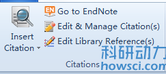
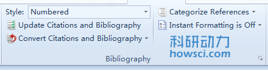
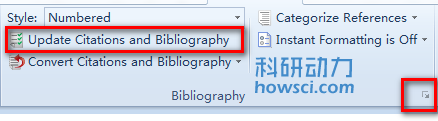
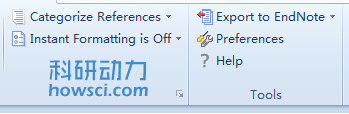

# 插入命令

CWYW 安装后，Word 工具栏就会有数个 EndNote 命令。从 EndNote 工具栏选择命令时，EndNote 会启动 EndNote 程序，CWYW 菜单也变成了活动状态

**注：**当使用 EndNote online 作为插入文献的程序时，EndNote online 的命令要少于 EndNote 桌面版的命令

下面是 Word 中 EndNote 工具栏 CWYW 命令的一些简要描述

### Citations 栏

* **Insert Citation &gt;&gt; Insert Citation：**可以查找 EndNote 文献并插入，见[查找并插入文献](Finding_n_Inserting_Cites.htm)
* **Insert Citation &gt;&gt; Insert Note：**在 Word 中插入注释，详见[参考文献中包含注释](Including_NotesinLstofRefs.htm).
* **Insert Citation  &gt;&gt; Insert Selected Citation\(s\)：**插入在数据库选中的文献，一次最多只能插入250个文献
* **Insert Citation  &gt;&gt; Insert Figure：**查找含有图表的文献并插入，详见[插入图表](Inserting_Selected_Cites.htm).
* **Go To EndNote：**返回 EndNote 程序
* **Edit & Manage Citation\(s\)：**修改引文，详见[编辑引文](Editing_Citations.htm)
* **Edit Library Reference\(s\)：**在文中选中引文，然后此命令可以直接编辑相应的文献

### Bibliography 栏

* **Style：**选择引文格式，列表中是显示的偏好引文格式
* **Update Citations and Bibliography：**格式化引文和参考文献
* **Convert Citations and Bibliography &gt;&gt; Convert to Unformatted Citations：**转换为未格式化状态，详见[未格式化引文](Unformatting_Citations.htm)
* **Convert Citations and Bibliography &gt;&gt; Convert to Plain Text：**备份为纯文本，去除[域代码](Field_Codes.htm)，详见[移除域代码](Removing_Field_Codes.htm)
* **Convert Citations and Bibliography &gt;&gt; Convert Word Citations to EndNote：**转换当前 Word 中插入的文献为引文
* **Convert Citations and Bibliography &gt;&gt; Convert Reference Manager Citations to EndNote：**转换当前文件中的 Reference Manager 插入的文献为引文
* **Configure Bibliography：**点击 Bibliography 栏右下角的箭头可以打开配置选项，在新对话框中选择「确定」会格式化引文，见[格式化参考文献](Formatting_th_BibnChngBib.htm)

**注：**默认「Instant Formatting」是打开状态，这样可以边插边格式化引文

### Tools 栏

* **Export to EndNote &gt;&gt; Export Traveling Library：**当有文件中的引文建立一个数据库，详见[导出 Word 的漫游数据库](Exporting_WrdTvlgLibtoEN.htm)
* **Export to EndNote &gt;&gt; Export Word Citations：**从 Word 中的引文创建 EndNote 数据库
* **Export to EndNote &gt;&gt; Export Word Master List：**Word 本身也可以插入引文，不知道大家注意了没，呵呵。这个就是导入 Word 自己插入的引文到 EndNote 数据库的
* **Preferences：**CWYW 设置，详见[ Cite While You Write 设置](../preferences/cwyw-general-preferences.md)
* **EndNote Help：**EndNote 帮助文件

可以在 [Cite While You Write 设置](../preferences/cwyw-keyboard-preferences.md)中为这些命令添加快捷键，解放鼠标，提高效率

**注：**有些 CWYW 命令同样也可以通过 EndNote 菜单 Tools &gt;&gt; Cite While You Write「CWYW」实现，但是使用这些命令的前提 已在Word中插入过至少一篇文献

