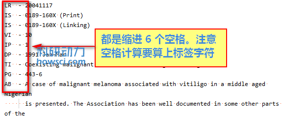

# 连续数据行

EndNote 一般忽略不以标签形状的的一行文本，但是文本是上一个标签的连续行的话还是导入，这种文本叫连续行 \(continuation lines\)。比如摘要，所包含的内容可能很多。在打开数据文件时，可能会看到换行。但是这种换行没有回车或者段落标记，只是自动换行。这种以一个标签开始的，中间没有人为换行的就是连续数据行

`AB- A single-subject research design that use multiple baselines across behaviors compared traditional adaptations to computers.`

因为 EndNote 只能导入标签行和连续数据库行。但是如果在连续数据行中，如果有多余的文本。比如数据库的登陆或者退出信息等等，比如下面是一个多余文字的例子：

 --&gt;&gt;Press any Key to continue

 &lt;Record 5 of 42&gt;

EndNot e有两种处理连续行的选项

**Ignore Indents: Untagged lines are always a continuation of the preceding line**

选中这个设置，如果开头没有标签的数据，都认为是连续数据行，EndNote 会把这一行数据与上一个标签行合并，并且导入到 EndNote。如果数据文件中有任何没有标签的文本，就不要选中这个选项。如果选中这个选项并且不想导入某些标签行，必须使用「{IGNORE}」选项。详见[{IGNORE}](../filter-templates/ignore-field.md)

**Continuation lines must be indented**

该选项指定连续数据行左侧必须缩进才认为是连续数据行，并且才能导入

下面的例子是一个摘要，数据的第一行有左侧6个空格，连续行缩进6个空格。EndNote 默认的 Smart Indent Identification 选项会准确导入这个摘要 \(点代表空格\)

数据文件中的多数行导入时有固定的空格数，但是标记区域的缩进是加上标签和字体一起算的

有时候不同的标签可能缩进不一样，比如摘要是缩进4个，但是关键词是缩进了两个，此时可以在「Exceptions」指定缩进不一样的数据行。在「Indent \_ spaces」中输入大部分标签的缩进，然后在Exceptions」中输入特殊的标签缩进。

**注：**快速靠的方法是可以打开 Word 在设置中显示空格可计算左边的插入了多少空格。我推荐 Notepad2，呵呵

