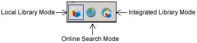

# 显示或隐藏组

### 组面板

[EndNote](http://www.howsci.com/tag/endnote/) 当前数据库窗口的左侧是组面板，列举了当前数据库下的所有组，以及每个组内的文献数。其中 All References, Unfiled, 和Trash groups 这些组是永久组，不能移动和重命名

群组的左侧的 **-** 号可以折叠当前群组， **+** 号展开当前群组。可以拖放右侧的竖线调整组面板的大小。如果不想显示组面板，可以依次打开菜单 Groups &gt;&gt; Hide Groups， 再次显示选择 Show Groups

### 显示模式

组面板有3种显示模式本地模式，在线模式和复合模式，详见[EndNote三种Mode模式的区别](http://www.howsci.com/endnot-the-diffrence-between-three-modes.html)

**Local Library Mode：**本地模式仅显示本地数据库中包含的且，该模式是[EndNote](http://www.howsci.com/tag/endnote/) 的默认模式

**Online Search Mode：**在线模式是仅显示在线数据库，而不显示本地数据库模式。该模式下在线检索的文献在关闭EndNote后自动消失，如果想把文献复制到本地数据库，要使用复制地本地数据库命令

**Integrated Library & Online Search Mode：**整合模式，包含本地数据库和在线数据库组，此模式下利用在线检索到的文献会自动拷贝到本地数据库

**注：**如想删除文献，选中然后拖到垃圾箱 Trash 组

**注：**如果仅想在线搜索而不想下载文献，建议使用在线搜索模式。[科研动力](http://www.howsci.com)建议先利用 PubMed 查询到文献后，再利用 PMID 号在复合模式下检索文献，原因详见[EndNote三种Mode模式的区别](http://www.howsci.com/endnot-the-diffrence-between-three-modes.html)

