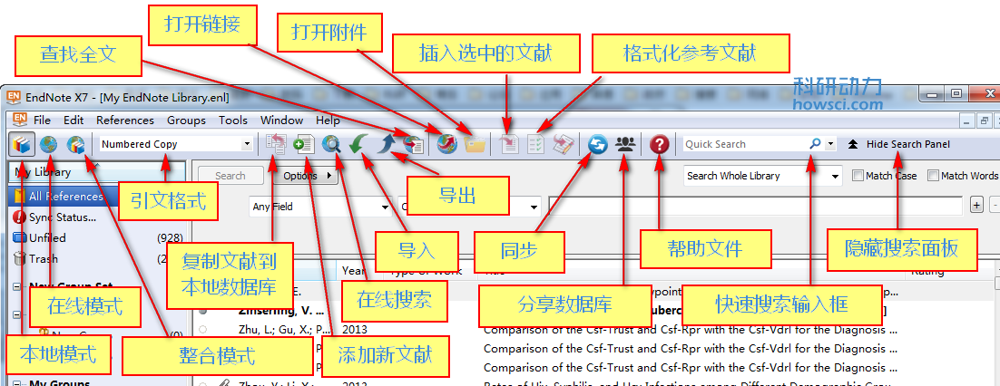

# 2.1 窗口

当第一次打开 EndNote 时，所看到的 EndNote 数据库由5个不同面板组成

* [组面板 The Groups Panel](the_groups_pane.md)
* [PDF查看面板 The PDF Viewer Panel](https://wiki.howsci.com/the_pdf_pane)
* [文献列表面板 The Reference List Panel](https://wiki.howsci.com/the_reflist_pane)
* [搜索面板 The Search Panel](https://wiki.howsci.com//the_search_pane)
* [分页面板 The Tabs Panel](https://wiki.howsci.com/the_tabs_pane)

可以通过鼠标点击面板的方法激活面板，或者通过「F6」在不同面板之间进行切换。

面板显示方式取决于所设置的布局，见下面叙述或者参阅[布局](https://wiki.howsci.com/the_display_modes)

## 工具栏

数据库工具栏有很多不同命令对文献进行操作，每个命令的详述请参阅[工具栏](https://wiki.howsci.com/toolbarswin)

## 同步功能

EndNote 桌面版如果购买了序列号有2年的免费同步到在线数据库功能。可以同步文献，包括附件也可以同步。但是前提是必须注册一个 EndNote 在线账号并激活同步功能

### **已有 EndNote 在线账号**

1. 点击工具栏的同步按钮打开同步对话框；
2. 输入在线账号的邮箱；
3. 输入密码；
4. 确定。

同步过程是自动的，经过同步 EndNote 桌面版和在线版之间会保持数据库一致

如果 EndNote 在线账号中修改过密码，同步时需要再次输入新的密码

**注意：**同步功能只能在 EndNote 桌面版中打开，而且要保持能有网络的情况下才能同步。EndNote桌面版不打开的情况下不能进行同步 \(真是费话啊\)

### **没有在线账号**

如果没有 EndNote 的在线账号，首先必需要注册一个

1. 工具栏中选择同步打开同步对话框
2. 选择「Sign Up」注册新的账号
3. 输入 e-mail，再次输入 e-mail 确认
4. 输入个人信息和密码
5. 选择同意并确认

有了EndNote在线账号就可以同步了，同步方法同上。

**注意：**建议同步前先备份数据库，最好[压缩备份数据库](https://wiki.howsci.com/saving_a_cmprssdcpy_ofa_lib)方式进行备份。

更多信息请参阅：[同步选项](https://wiki.howsci.com/synchronization_prefs) 和 [同步功能](https://wiki.howsci.com/overview_of_sync_process)

## 布局

在数据库窗口右下角选择「Layout」按钮可以改变布局样式，共有7种布局可选

### **组面板**

**Left / Off：**隐藏或者左侧显示组面板，可与其它布局混合使用

### **文献面板**

**Right：**Reference, Preview, 和 PDF Viewer 3个面板合为1个分页面板显示于文献列表的右方。该布局是EndNote默认布局

**Right - Split：**Reference/Preview 合二为一，PD F查看面板分离，在文献列表的右侧显示

**Bottom:**Reference, Preview, 和 PDF Viewer 3个面板合为1个分页面板显示于文献列表的下方

**Bottom - Split：** Reference/Preview 合二为一，PDF 查看面板分离，显示于文献列表的下方

**Off：** 隐藏 Reference, Preview, 和 PDF Viewer 面板，组面板和文献列表面板分两侧显示

### 搜索面板

布局不影响搜索面板的显示，不管选择何种布局搜索面板都显示于 EndNote 窗口的上方

如果想隐藏搜索面板可在 EndNote 窗口右上方的「Hide Search Panel 」进行隐藏，此时按钮变成了「Show Search Panel 」，再次点击又可显示搜索面板

检索在线数据库时，在组面板中选择「Online Search」组，或者在工具栏中直接选择在线搜索，详见[搜索面板](https://wiki.howsci.com/the_search_pane)

## 显示模式

EndNote数据库有3种显示模式，更多信息请参阅：[EndNote三种Mode模式的区别](http://www.howsci.com/endnot-the-diffrence-between-three-modes.html)

**Local Library Mode：**EndNote 默认显示模式，只显示本地数据库

**Online Search Mode：** 在线模式，只显示在线数据库，此时检索的文献如需保留需拷贝到本地数据库中

**Integrated Library & Online Search Mode：**整合模式。同时显示本地数据库和在线检索数据库，此时检索结果自动拷贝到本地数据库中

如果想删除文献，在「All Referecnes」组中选中文献按「Del」键，或者在任何组中选中文拖动文献到垃圾箱「Trash folder」

**注意：** 如果不想保留所有检索结果建议使用在线模式，但要需要的文献拷贝到本地数据库中。科研动力更建议是「Integrated Library & Online Search Mode」模式，原因详见[EndNote三种Mode模式的区别](http://www.howsci.com/endnot-the-diffrence-between-three-modes.html)

更多信息请参阅：[显示模式](https://wiki.howsci.com/the_display_modes)

## 窗口大小

如果想改变窗口大小直接按住边框进行拖放即可，和其他软件改变窗口大小方法一样。另外可以通过最大化或者最小化的方式改变窗口大小。

EndNote 会记住最后窗口大小，下次再打开的时候就会最后窗口大小进行显示。

## 数据库字体

EndNote 默认字体依 Windows 版本而定。如果想自定义字体大小 可通过选项设置，依次打开「Edit」 &gt;&gt; 「Preferences」 &gt;&gt; 「Display Fonts」 &gt;&gt; 「Library」进行设置。

General 是控制的预览面板字体，Lable 是控制的标签字体，Search 是控制的搜索字体。更多信息请参阅：[字体设置](https://wiki.howsci.com/display_fonts)

**注意：**此处的字体设置不影响在Word中插入参考文献的字体样式和大小

## 修改显示栏目

EndNote默认在文献列表面板中第一栏是显示 Read / Unread，之后是：

* File Attachments
* Author
* Year
* Title
* Rating
* Journal / Secondary Title
* Last Updated
* Reference Type

要以通过拖放的方式对栏目进行排序。也可以通过右键选择需要显示或者隐藏的区域，详见[显示栏目设置](https://wiki.howsci.com/display_fields)

### 文献排序

EndNote 默认是以作者名字进行排序的，如想改变排序方法，在文献列表面板的工具栏进行选择排序即可。详见 [文献排序](https://wiki.howsci.com/sorting_the_library)

## 相关教程

* [显示栏目设置](https://wiki.howsci.com/display_fields)
* [字体设置](https://wiki.howsci.com/display_fonts)
* [数据库注意要点](https://wiki.howsci.com/important_points_abt_libs)
* [文献列表面板](https://wiki.howsci.com/the_reflist_pane)
* [数据库统计](https://wiki.howsci.com/record_summary)

