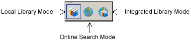

# 显示模式

EndNote的显示模式有以下3种

* 本地模式 \(Local Library Mode\)
* 在线模式 \(Online Search Mode\)
* 整合模式 \(Integrated Library & Online Search Mode\)

**Local Library Mode：** EndNote默认显示模式，只显示本地数据库

**Online Search Mode：** 在线模式，只显示在线数据库，此时检索的文献如需保留需拷贝到本地数据库中

**Integrated Library & Online Search Mode：**同时显示本地数据库和在线检索数据库，此时检索结果自动拷贝到本地数据库中

**注意：** 检索模式下如果想保留文献需要把文献拷贝到本地数据库中。建议使用在线模式，把需要的文献拷贝到本地数据库中。科研动力更建议是整合模式模式，原因详见[EndNote三种Mode模式的区别](http://www.howsci.com/endnot-the-diffrence-between-three-modes.html)

