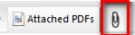
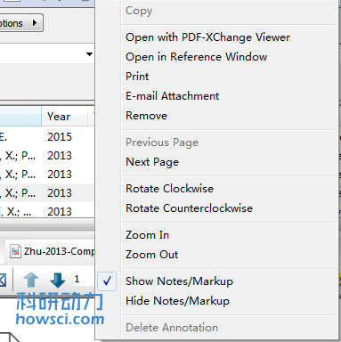

# PDF 查看面板

**首先多说一句，我个人认为 EndNote 这个 PDF 查看器是比较蛋疼的，我个人喜欢我设置的 PDF 阅读软件打开 PDF ，而不是在 EndNote 内打开 PDF 阅读。当然在 EndNote 内阅读也有一小小的好处，那就是在 PDF 里作的笔记也可以利用 EndNote 的搜索功能搜索到，但是我还是认为是个很鸡肋的功能**

在数据库窗口右下角选择布局，要选择能有 PDF 查看面板的布局。

选择 PDF 查看标签或者文献窗口打开 PDF 查看面板。

打开 PDF 文件可以在文献列表面板中选中文献然后双击。如果想利用第三方 PDF 阅读软件打开 PDF ，可以在 PDF 标签上右击，选择「Open with...」省略号代表默认的 PDF 阅读软件。

## 添加 PDF 附件

添加 PDF 附件的方法有很多，常用的有以下几种。

* 使用 PDF 标签旁边的附件图标进行添加。

* 选中文献然后在在菜单Reference中选择「File Attachments」 &gt;&gt; 「Attach File」。
* 选中文献右击，「File Attachments」 &gt;&gt; 「Attach File」打开添加附件对话框。
* 在文献列表面板双击文献，在 PDF 标签上右击或者添加附件图标或者「Ctrl+Alt+A」添加附件。

如果对 PDF 进行了标记等操作，点击 PDF 保存图标进行保存。如果直接关闭查看面板，EndNote 也会提示你是不是要保存。

## PDF 查看面板

EndNote 可以在 PDF 查看面板中打开和注释 PDF 文件。在文献列表面板中选择有 PDF 附件的文献可以查看 PDF 文件。注释窗口大小可以通过拖拉方式自定义

## PDF 查看工具栏

PDF 查看工具栏有以下几个选项。

把鼠标放置在工具栏的图标上，可以查看当前图标名称和功能。比如把鼠标放置在第一个图标上会提示：

* 在文献查看窗口打开 PDF
* 保存
* 打印
* ...

右击可以打开扩展菜单，有很多选项，如：

* Open with Adobe Acrobat。[科研动力](http://www.howsci.com/)注：此处因操作系统默认的 PDF 阅读器不同而不同。
* Open in Reference Window
* E-mail Attachment
* Remove
* Show Notes / Markup
* Hides Notes / Markupa

## 查找

PDF 查看器工具栏的查找功能可以查找 PDF 文件中单词或者短语。在输入框中输入要查询的单词或者短语，然后回车即可查找，使用前 Next 和 Previous 按钮可以继续找到的下一个单词或短语位置。

该查找功能仅局限于当前打开的 PDF ，不能使用这个功能在文献面板中查找其他 PDF 文件。如果一个文献添加了两个 PDF 文件，只能在当前打开的 PDF 文件中进行查找。

查找结果会以高亮方式显示，如：

* 查找 **howsci** 会匹配 howsci , howscic , howscicom 等单词
* 查找 **howsci com** 仅匹配 howsci com
* 查找 **"howsci com"** 会匹配 "howsci com"

## 添加注释和高亮

在 PDF 查看器中，可以对某些地方进行注释和高亮。

### **添加评论**

1. 选择需要添加评论的地方
2. 选择需要添加评论的文本
3. 在工具栏中选择 Sticky Note 图标
4. 在 PDF 中双击会出现评论框
5. 在评论框中输入评论
6. 选择工具栏中的 Save PDF 图标保存改变

**注意：** 如想删除评论，右击选择 move 删除。

### **文本高亮**

1. 找到需要高亮的文本
2. 选择需要高亮的文本
3. 工具栏中选择 Highlight Text 图标，选中文本即以黄色显示
4. 保存改变

隐藏评论和高亮可以把恍如鼠标移动文本上，右击，然后选择 Hide Notes/Markup 即可隐藏，如果再次显示右击选择 Show Notes/Markup

**注意：**

* 搜索面板中也可以搜索评论内容，在搜索面板中选择「Any Field + PDF with Notes」和「 PDF Notes」即可。
* PDF 文件内不能移动评论图标，但是可以移动评论框。

