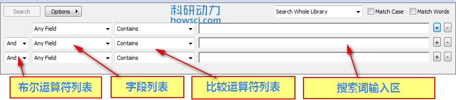

# 搜索面板

不管是什么布局。EndNote 搜索面板在都 EndNote 窗口上方。

在窗口的右上方可以通过 Show Search Panel 和 Hide Search Panel显示和隐藏搜索面板。

如果想利用搜索面板搜索进行本地数据库搜索，首先选择一个组，然后在搜索面板的输入框中输入检索词，回车即可。

如果想在线搜索，首先在组面板中选择一个在线数据库，或者在菜单中选择 Tools &gt;&gt; Online Search，选择一个在线数据库。

## 搜索行

搜索行可以使用布尔运算符，在搜索面板左侧选择限定条件，在右侧输入行输入关键词。最右侧的+号或者-号可以增加限制条件。

## 布尔运算列表

可以使用 AND, OR, 和 NOT 等布尔运算符进行搜索。详细信息请参阅：[布尔运算符进](Combining_SrchLnsAndOrNot.htm)

## 栏目列表

栏目列表可以限制搜索条件，如 Author, Year, or Keywords 或 Any Field。EndNote 默认栏目列表是搜索 Author，然后是 Year，然后是 Title

还可以限制搜索 PDF 附件，使用 Any Field + PDF 选项可以搜索文献的任何栏目和所有PDF附件。

参阅[栏目搜索](Restricting_SrchstoSpcFlds.htm)

## 比较运算符列表

比较运算符意味着搜索关键词与字段的关系。如：

* 期刊名称以「howsci」开头就要在比较列表中选择「Word begins with」
* 期刊名称包含「howsci」选择「contains」
* 期刊名称就叫「howsci」选择「is」

参阅[比较运算符](Using_ComparisonOpratrs.htm)获取详细信息

## 搜索词输入区

搜索区是输入关键词或字段的地方，在搜索区输入一个或多个关键词，回车即可搜索。

「Options」按钮可以保存当前搜索等多种选项。

## 通配符「\*」

在关键词之前或者之后可以添加通配符，星号 \(\*\) 代表任何字符

* 文献和PDF文件都可以使用通配符搜索
* 没有最小长度限制

**注：** 虽然 EndNote 自动适用于左侧或者右侧截断搜索条件，但是仍可以在关键词之前或者之后使用通配符。

## 搜索设置列表

在搜索区上方是搜索设置列表，可以设置特殊搜索以及搜索结果如何与其他文献相匹配。默认是搜索当前显示的组内文献，仅显示搜索结果。

**Match Case**

EndNote 默认搜索数据库时忽略大小写，如搜索**howsci**，同时也搜索 HowSci

当选择 Match Case 选项时，EndNote会严格匹配关键词，如输入**howsci**，同时选择Match Case,，EndNote会忽略 「Howsci」和「HowSci」等词，仅匹配「howsci」。

当选择 Match Case 选项时「é」「ü」 和「î」会严格匹配这些字符，如搜索 **résumé** 会严格匹配「 résumé」。如果想搜索这些特殊符号的替换字符，如「é」替换成「e」，就不相选择 Match Case 选项。

**Match Words**

如果选择 Match Words 选项，EndNote 会匹配相应的单词。如搜索 **howsci** EndNote会搜索「HowSci」或「Howsci」等等

## 保存搜索策略和转入搜索策略

如果经常搜索同一个关键词或者搜索式，可以把这个关键词或者搜索式保存下来以备用。Options 按钮的「Save search」保存搜索策略，「Load search」载入保存的搜索策略。参阅[保存搜索](Saving_Search_Strategies.htm)了解更多详细信息。

## 设置为默认

Options 按钮下的 Set Default 是把当前除了关键词之处的搜索选项保存为默认选项，Restore Default 是恢复 EndNote 默认的搜索选项。参阅[搜索注意事项](Search_Command_Tips.htm)和[利用好EndNote查询功能](https://www.howsci.com/endnote-search-fuction.html)以获得更详细信息。

