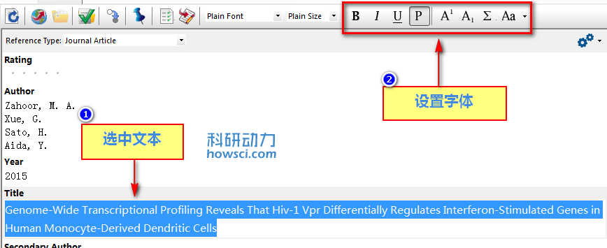

# 纯文本

纯文本（Plain Text），平滑字体（Plain Text）和普通大小（Plain Text）命令位于菜单Edit，或在文献编辑窗口选中文本上在样式工具栏上。

当 EndNote 建立参考文献时，字体和大小取决于 Word 的设置。首先选择想改变的文本，然后从菜单 Edit 或者工具栏中选择 Plain Text, Plain Font, 或 Plain Size

默认显示纯文本的字体是操作系统默认字体，可以通过设置中的 Display Fonts 选项下的 General font 选项进行设置，菜单 Edit &gt;&gt; Preferences &gt;&gt; Display Fonts，Genera 字体设置不改变参考文献中的字体。

