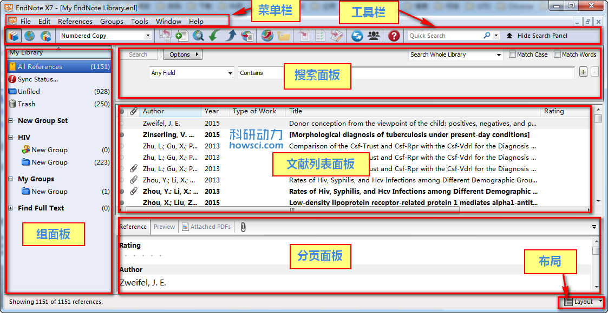

# 3.1 窗口

文献窗口显示文献内容，文献列表窗口的文献根据文献字段进行排序，[文献类型](../Appendices/List_of_Reference_Types.htm)显示文献是杂志，书籍还是会议论文等

文献窗口的顶部是文献的作者名，发表年代等信息。为了解释的更清楚，在文末提供了视频。

### 布局

EndNote 默认显示分页窗口，选择右下角「Layout」按钮可以定义窗口的布局样式

* 「Off」选项是关闭 PDF 查看面板
* 「Right」选项是 PDF 查看面板显示于右侧

**已读/未读 Read / Unread Buttons**

这两个决定文献的阅读状态

**评级 Rating**

决定文献的重要性，最高5级，点击点就会变成星，再次点击星就会变成点。[合理使用EndNote的评分Rating功能](https://www.howsci.com/endnote-rating.html)可以起到事半功倍的效果。

**样式**

选择文本可以设置样式，可用的样式有粗体，斜体，下划线，字体，上标，下标，符号字体等。

**大小写**

选中文可以改变文本大小写，选项有每句第一单词首字母大写，整句大写，整句小写，每个单词首字母大写，大小写转换\(如开始中每个单词首字母大写，这个选项会变成首字母小写，其余字母大写，反之亦然\)。

**E-mail 选项**

E-mail 选项可以把附件传给同事，在文献窗口PDF面板任何部位右击，在扩展菜单中选择 E-mail Attatchment，之后会调用把文献和附件传给同事。如果文献没有附件就不能调用 E-mail 选项。

### 查找文献更新

选择 Find Reference Update 按钮是查找文献最后更新情况。EndNote会搜索可用服务器进行查找，，如果找到，EndNote会显示更新对话框。参阅[更新对话框](Find_Reference_Updates.htm)了解更多信息。

### 扩展菜单

* 打开文献列表面板，任何位置右击调用窗口控制命令
* 选择 Hide Empty Fields 隐藏没人内容栏目
* 选择 Show Empty Fields 显示所有栏目
* Ctrl+Shift+W 关闭所有打开的文献窗口

### 附件

* Ctrl+Alt+A 添加附件
* 双击 PDF 文件载入 PDF 系统默认阅读器
* 选择附件图标添加附件
* 选择图像图标添加图像附件

### 快捷键

* Tab 键可以移至下一个栏目，Shift+Tab 上一个栏目。
* 左方向键上一个文献，右方向键下一个文献

